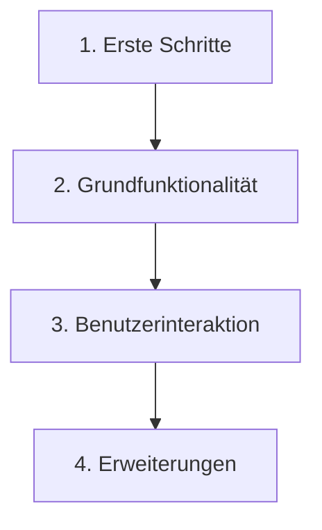

# Einführung

## Über dieses Tutorial

> 🎯 **Ziel**: Entwicklung einer virtuellen Kaffeemaschine in Rust

Dieses Tutorial dokumentiert die Entwicklung einer Kaffeemaschinen-Simulation in Rust. Es ist sowohl als Leitfaden für Lernende gedacht als auch eine Dokumentation meines eigenen Lernprozesses mit Rust.

### Was wir entwickeln werden

Wir werden eine virtuelle Kaffeemaschine erstellen, die:
- Verschiedene Kaffeespezialitäten zubereiten kann
- Zutaten und Abfälle verwaltet
- Über ein interaktives Menü bedienbar ist
- Fehler sicher behandelt

### Projektziele

1. **Lernen durch Praxis**: Rust-Konzepte in einem realitätsnahen Projekt anwenden
2. **Modulares Design**: Saubere, wartbare Codestruktur entwickeln
3. **Testgetriebene Entwicklung**: Funktionalität durch Tests absichern

## Projektübersicht

### Kapitelstruktur



1. **Erste Schritte**
   - Projektsetup und Grundstruktur
   - Basiskomponenten erstellen
   - Erste Implementierungen

2. **Grundfunktionalität**
   - Verwaltung von Rezepten
   - Zutatenmanagement
   - Fehlerbehandlung

3. **Benutzerinteraktion**
   - Menüsystem
   - Fortschrittsanzeigen
   - Benutzereingaben

4. **Erweiterungen**
   - Testabdeckung
   - Dokumentation
   - Optimierungen

## Voraussetzungen

### Technische Anforderungen
- Rust-Installation ([rustup](https://rustup.rs/))
- Cargo (kommt mit Rust)
- Ein Texteditor oder IDE
- Git für Versionskontrolle

### Kenntnisse
- Grundlegende Programmiererfahrung
- Basis-Verständnis von Rust ([The Book](https://doc.rust-lang.org/book/))
- Terminal/Kommandozeile

## Projektressourcen

### Repository
- GitHub: [rusty-coffeemachine](https://github.com/KarnesTH/rusty-coffeemachine)
- Vollständiger Quellcode

### Lokales Setup
```bash
# Repository klonen
git clone https://github.com/KarnesTH/rusty-coffeemachine
cd rusty-coffeemachine

# Projekt bauen und ausführen
cargo build
cargo run
```

## Was uns erwartet

In diesem Tutorial werden wir:
- Eine vollständige Anwendung von Grund auf entwickeln
- Rust's Typ- und Ownership-System nutzen
- Fehlerbehandlung implementieren
- Tests schreiben
- Code dokumentieren

> 💡 **Tipp**: Jedes Kapitel baut auf dem vorherigen auf. Experimentiere mit dem Code und passe ihn an deine Bedürfnisse an!

---

Bereit zu starten? Lass uns im ersten Kapitel das Projekt aufsetzen!
